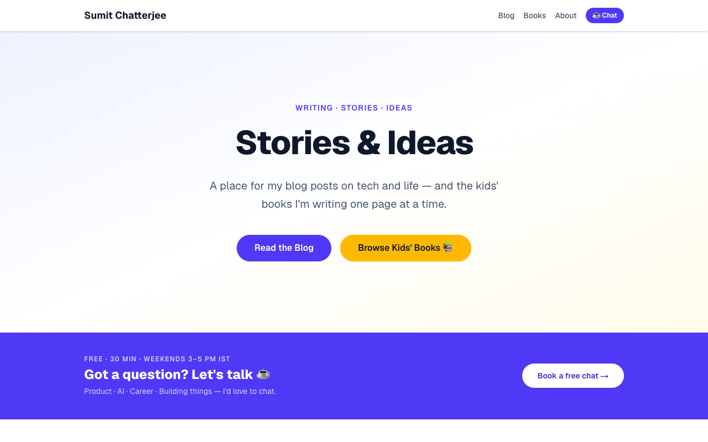
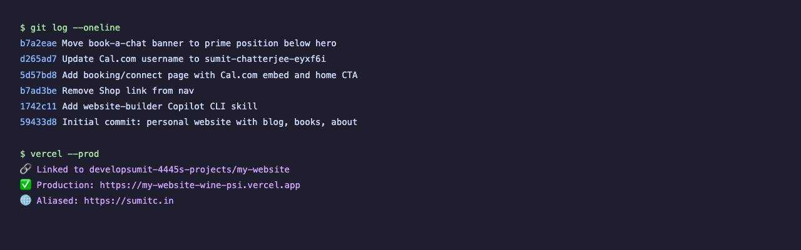
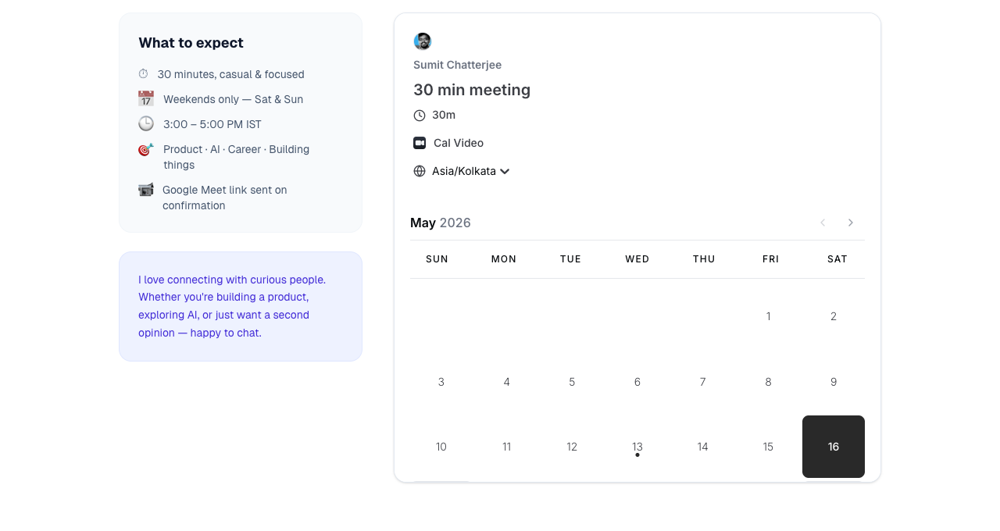

# Zero Code. One Evening. Live Website.

> *What building sumitc.in with AI taught me about where the real work actually is.*

---

I used to think the hard part of a personal website was the *building*. I was wrong.

One evening, I described what I wanted to GitHub Copilot CLI. By the end of the night, [sumitc.in](https://sumitc.in) was live — blog, kids' books section, custom domain, booking page. The tech wasn't the hard part. Three questions were — and most people skip the third one entirely:

- **Who is this for?** *(people curious about tech, AI, and building things)*
- **What value does it create?** *(a place to read my work and reach out easily)*
- **What connects everything I do?** *(products, writing, kids' books, experiments — all curiosity-driven building)*

That third question is the one that gives a site a soul. Without it, you end up with something that looks like a LinkedIn profile. Once I answered all three honestly, everything else snapped into place.

---

Once the *why* was clear, the *how* took one evening.

The tool I used is **GitHub Copilot CLI** — not the IDE autocomplete you might know, but a conversational AI agent that lives in your terminal. You describe what you want; it writes the code, runs the commands, and asks when it needs a decision from you. No switching tabs. No copy-pasting from ChatGPT. You're just talking to something that can *act*.

One thing worth calling out: the model powering it was **Claude Sonnet 4.6** — not Opus, not some frontier model people assume you need for "serious" work. The whole site — scaffold, blog wiring, DNS setup, booking page, multi-platform RSS sync — was built on Sonnet. The gap between what Sonnet can do and what people *think* you need Opus for is much larger than most realise.

Here's the actual process:

1. Described the site in plain English → Copilot scaffolded a full Next.js project
2. Wired to existing markdown content → blog posts pulled in automatically
3. `git push` → `vercel --prod` → two DNS record changes in GoDaddy → live

**Total infrastructure cost: zero.** Vercel handles SSL, CDN, and auto-deploys on every push.

A few tricks that saved time:
- Use **Vercel** (not Render) when there's no backend API
- Always **delete old A records** before adding new DNS ones
- **RSS feeds** from Medium and Substack auto-sync titles and dates to the site

---

The real surprise came *after* the launch. Because I'd saved all styling preferences and decisions as a reusable Copilot CLI skill, every update became trivial:

- **Booking page** (Cal.com + Google Calendar): one conversation, one deploy
- **Consistent tag colours** across blog cards: one instruction
- **Nav cleanup**, CTA placement, RSS sync: each a single `git push`

The site doesn't feel like a project I *finished* — it feels like something I can keep shaping. That's the unlock: build it so coming back is as easy as starting.

If you're thinking about doing the same — [book a 30-min chat](https://sumitc.in/connect), weekends, free. Happy to walk through it.

---

> **What's been stopping you from putting your site live? Drop it in the comments.**

*I write about AI, product building, and the things I'm making. Follow so you don't miss the next one.*

